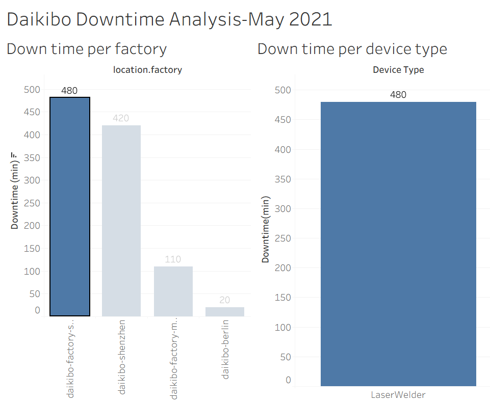

# Deloitte Forensic Analytics - Virtual Experience Program

## 📌 Project Overview
Completed forensic data analysis as part of Deloitte's Virtual Experience Program on Forage. Analyzed vendor transaction data to identify high-risk patterns and anomalies.

## 🛠️ Tools Used
- **Tableau**: Interactive dashboard for vendor risk analysis
- **Excel**: Data cleaning and Equality Table creation

## 🎯 Key Tasks Performed
1. Cleaned and structured raw vendor data using Excel
2. Created Equality Table to match invoice vs payment data
3. Built Tableau dashboard to visualize risk metrics by vendor
4. Identified vendors with highest anomaly scores for further investigation

## 📊 Deliverables
- `daikibo_analysis.twbx` - Tableau Dashboard
- `Equality Table_Devendra.xlsx` - Processed Excel Data
- `dashboard-screenshot.png` - Dashboard Preview

## 📚 Skills Demonstrated
Data Cleaning, Forensic Analysis, Tableau Visualization, Excel Reporting
